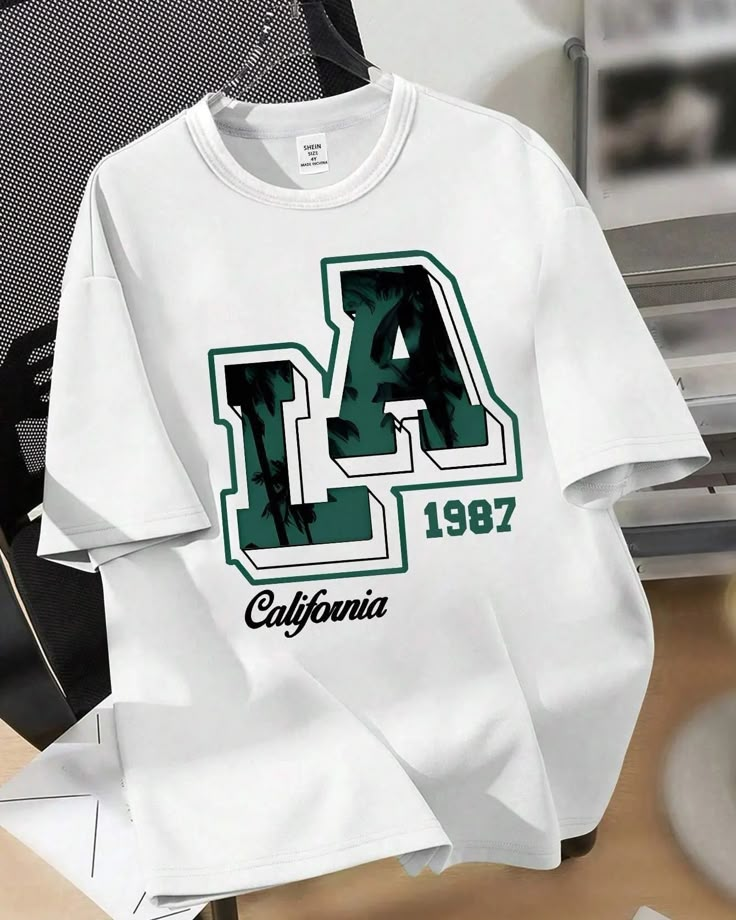
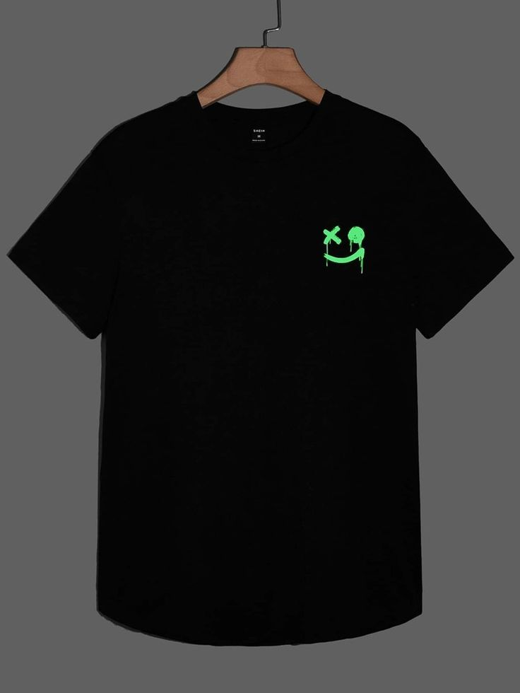
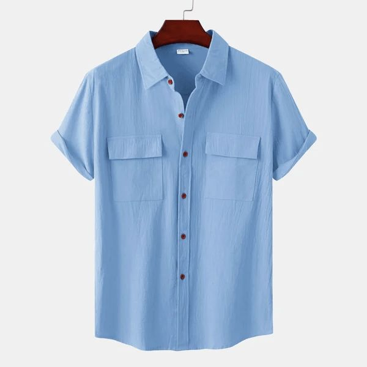
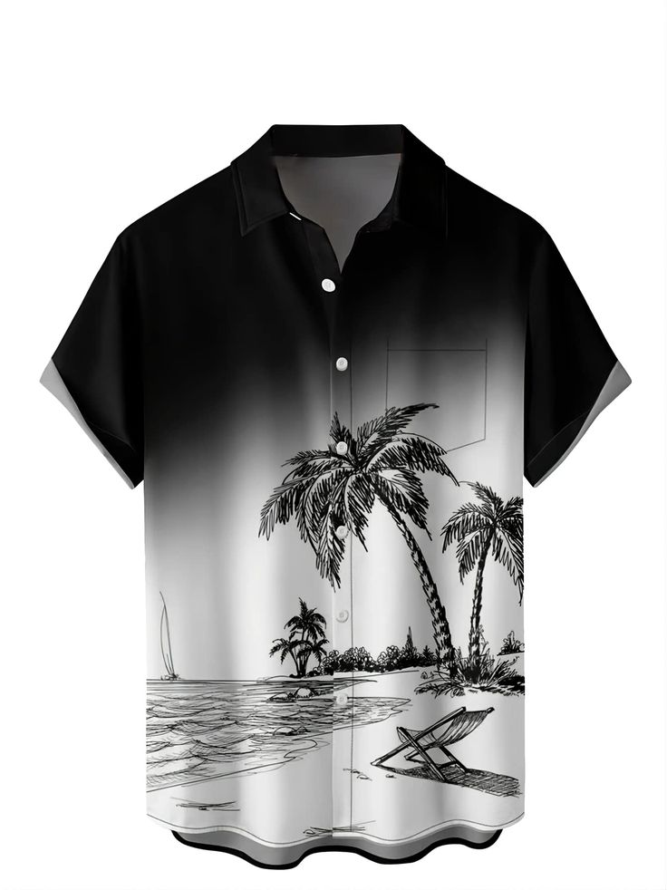
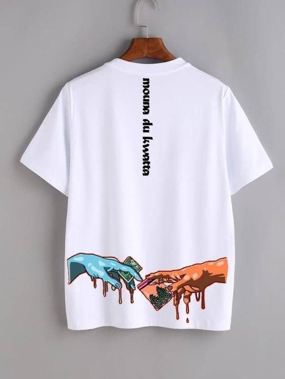
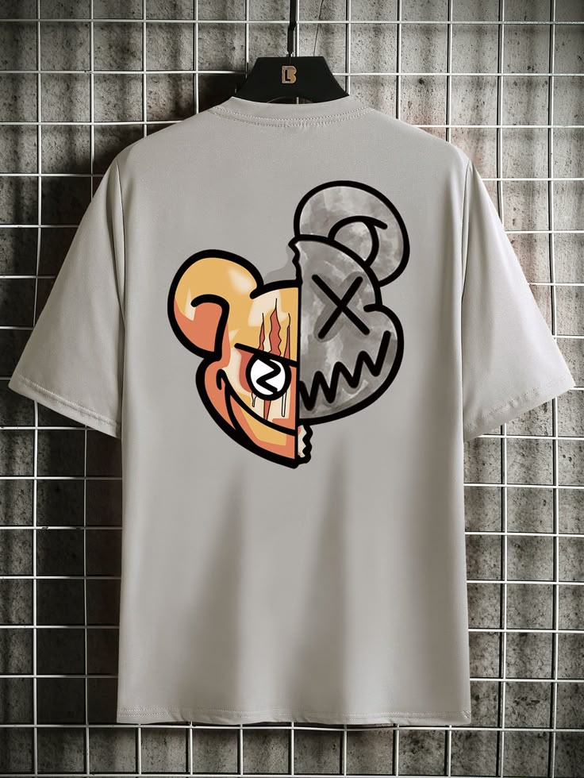
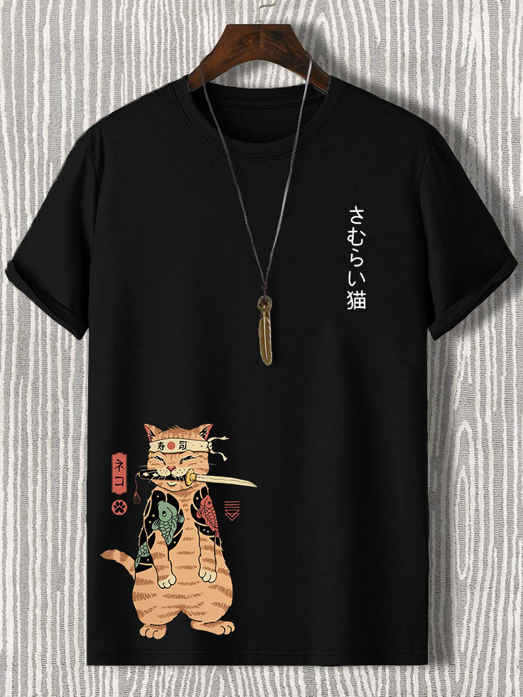
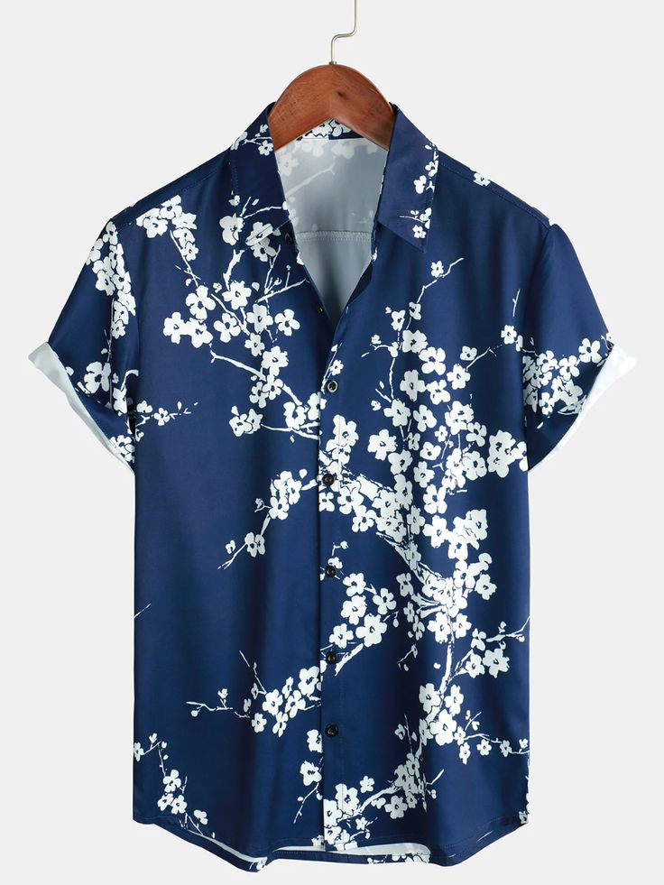

<html lang="es">
<head>
    <meta charset="UTF-8">
    <meta name="viewport" content="width=device-width, initial-scale=1.0">
    <title>Fondo de Imagen</title>
    
</head>
<body>

<html lang="es">
<head>
    <meta charset="UTF-8">
    <meta name="viewport" content="width=device-width, initial-scale=1.0">
    <title>Detalle del Producto</title>
    
</head>
<body>
    

        
        

            <h1>camisa  </h1>
            

camisa blanca con diseño 
            

            <a href="https://wa.me/50586574008?text=Hola,%20estoy%20interesado%20en%20el%20producto%20'Nombre%20del%20 camisa con diseño  '" class="whatsapp-button" target="_blank">
                Contactar por WhatsApp
            </a>
        

 

        
        

            <h1>camisa  </h1>
            

        camisa negra con diseño 
            

            <a href="https://wa.me/50586574008?text=Hola,%20estoy%20interesado%20en%20el%20producto%20'Nombre%20del%20 camisa negra  '" class="whatsapp-button" target="_blank">
                Contactar por WhatsApp
            </a>
        

        
        

            <h1> formal   </h1>
            

camisa formal azul 
            

            <a href="https://wa.me/50586574008?text=Hola,%20estoy%20interesado%20en%20el%20producto%20'Nombre%20del%20camisa formal azul '" class="whatsapp-button" target="_blank">
                Contactar por WhatsApp
            </a>
        

        
        

            <h1>camisa playera    </h1>
            

camisa playera con diseño de palmas 
            

            <a href="https://wa.me/50586574008?text=Hola,%20estoy%20interesado%20en%20el%20producto%20'Nombre%20del%20camisa playera con diseño de palmas '" class="whatsapp-button" target="_blank">
                Contactar por WhatsApp
            </a>
        

        
        

            <h1>camisa   </h1>
            

camisa con diseño 
            

            <a href="https://wa.me/50586574008?text=Hola,%20estoy%20interesado%20en%20el%20producto%20'Nombre%20del%20camisa con diseño  '" class="whatsapp-button" target="_blank">
                Contactar por WhatsApp
            </a>
        

    

        
        

            <h1> formal      </h1>
            

camisa formal con diseño de cartas color cafe 
            

            <a href="https://wa.me/50586574008?text=Hola,%20estoy%20interesado%20en%20el%20producto%20'Nombre%20del%20 camisa formal  '" class="whatsapp-button" target="_blank">
                Contactar por WhatsApp
            </a>
        

            

        
        

            <h1> camiseta    </h1>
            

camiseta con diseño 
            

            <a href="https://wa.me/50586574008?text=Hola,%20estoy%20interesado%20en%20el%20producto%20'Nombre%20del%20 camiseta con diseño '" class="whatsapp-button" target="_blank">
                Contactar por WhatsApp
            </a>
        

        

        
        

            <h1> camiseta   </h1>
            

camiseta negra con diseño japones 
            

            <a href="https://wa.me/50586574008?text=Hola,%20estoy%20interesado%20en%20el%20producto%20'Nombre%20del%20 camiseta con diseño japones   '" class="whatsapp-button" target="_blank">
                Contactar por WhatsApp
            </a>
        

           

        
        

            <h1>formal   </h1>
            

camisa formal con diseño de hojas japonesa 
            

            <a href="https://wa.me/50586574008?text=Hola,%20estoy%20interesado%20en%20el%20producto%20'Nombre%20del%20camiseta formal '" class="whatsapp-button" target="_blank">
                Contactar por WhatsApp
            </a>
        

    <a href="https://ice2606.github.io/elegante-02/" class="back-button">
        Ir atrás
    </a>
 

